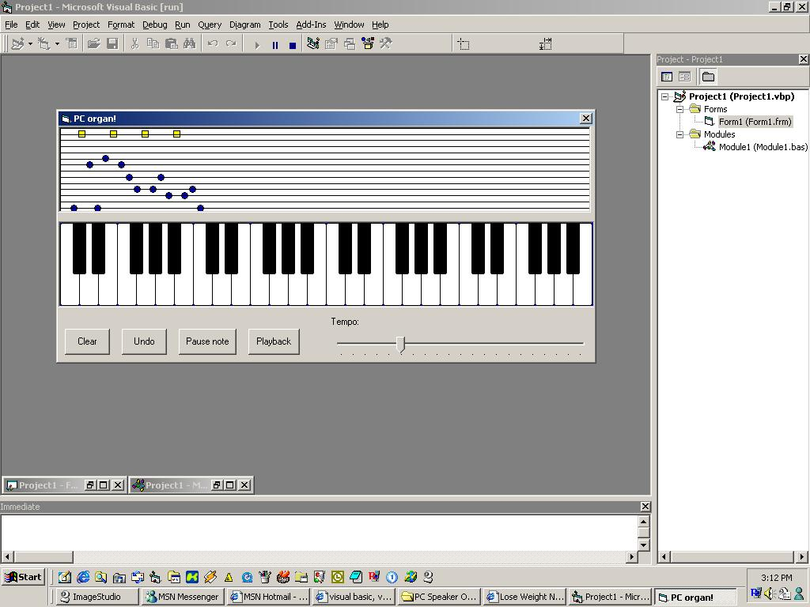

<div align="center">

## PC Speaker Organ


</div>

### Description

This code provides and example of what can be done with the System Speaker with the 'Beep' function in the Kernel32.dll API.
 
### More Info
 
Mouse cliks in appriate areas.

Musical Notes


<span>             |<span>
---                |---
**Submitted On**   |2002-10-25 15:17:36
**By**             |[Scott Rauscher, MCP](https://github.com/Planet-Source-Code/PSCIndex/blob/master/ByAuthor/scott-rauscher-mcp.md)
**Level**          |Intermediate
**User Rating**    |5.0 (15 globes from 3 users)
**Compatibility**  |VB 5\.0, VB 6\.0
**Category**       |[Windows API Call/ Explanation](https://github.com/Planet-Source-Code/PSCIndex/blob/master/ByCategory/windows-api-call-explanation__1-39.md)
**World**          |[Visual Basic](https://github.com/Planet-Source-Code/PSCIndex/blob/master/ByWorld/visual-basic.md)
**Archive File**   |[PC\_Speaker14871210252002\.zip](https://github.com/Planet-Source-Code/scott-rauscher-mcp-pc-speaker-organ__1-40153/archive/master.zip)

### API Declarations

```
Declare Function Beep Lib "Kernel32"(ByVal dwFreq As Long, ByVal dwDuration As Long) As Long
```


